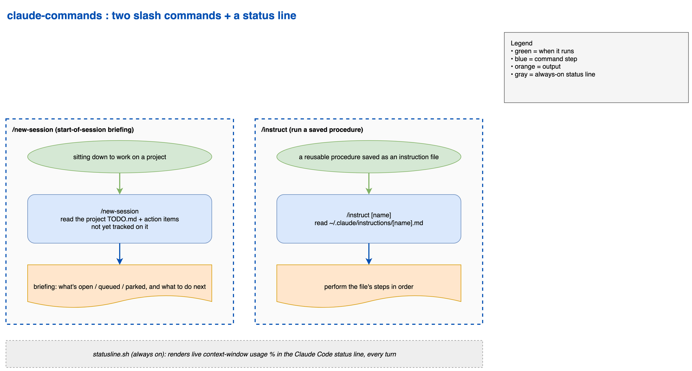

# Claude Code commands

Two slash commands for Claude Code, plus a status-line script that shows your context-window usage continuously.



Source: [docs/commands-flow.drawio](docs/commands-flow.drawio) (editable in draw.io).

- **`/new-session`** — start-of-session briefing for a project: its open TODO items, plus open action items not yet tracked in the TODO (from CLAUDE.md, project memory, git state, open PRs, and code markers). Read-only.
- **`/instruct <file>`** — run an instruction file from `~/.claude/instructions/` (or a path): switches to Plan mode, resolves and reads the file, drafts a plan, and waits for your approval before executing.
- **`statusline.sh`** — prints e.g. `[Opus 4.8] claude-commands (main) · 37% used · 63% left · 74K/200K` (model, current directory and git branch, context used and remaining percentage, and the in-window token count vs capacity) so your usage is always visible at the bottom of the terminal. Two parts are color-coded. The context percentage is green below 40% used, yellow from 40 to 60%, and red above 60%. The token count is a gauge of the same kind: green while under 400K, a yellow `over 400K` flag once it passes 400K, and a red `over 600K` past 600K (those flags only appear in extended-context sessions, where the window is larger than 400K). The cutoffs (`YELLOW_PCT`, `RED_PCT`, `OVER_YELLOW`, `OVER_RED`) are variables at the top of the script; change them to retarget the colors and flags.

## Install

### Commands

Copy the command files into your Claude Code commands directory:

```bash
mkdir -p ~/.claude/commands
cp commands/*.md ~/.claude/commands/
```

They're available immediately as `/new-session` and `/instruct`.

### Status line

The status line replaces the old manual "run /context" step in `/new-session`: instead of asking, your context usage shows continuously.

1. Install `jq` if you don't have it (`brew install jq` on macOS, `apt install jq` on Debian/Ubuntu). The script uses it to parse the session JSON Claude Code pipes in.
2. Copy the script and make it executable:
   ```bash
   cp statusline.sh ~/.claude/statusline.sh
   chmod +x ~/.claude/statusline.sh
   ```
3. Add this to `~/.claude/settings.json` (merge into your existing settings, don't overwrite the file):
   ```json
   {
     "statusLine": {
       "type": "command",
       "command": "bash ~/.claude/statusline.sh"
     }
   }
   ```

Restart Claude Code (or start a new session) and you'll see something like `[Opus 4.8] claude-commands (main) · 37% used · 63% left · 74K/200K` in the status line, with the percentage and token count color-coded green/yellow/red by fill level. The context fields can be null right after start or a `/compact`; the script falls back to `0` until the first API call populates them. The git branch is omitted when the directory isn't a repo.

## Notes

- `/new-session` works best if you keep per-project notes under `~/.claude/projects/<X>/` (a `TODO.md` and an optional `CLAUDE.md` / `memory/` folder). It degrades gracefully when those don't exist: it just reports what it can find from git and open PRs. Paths are derived from `$HOME`, so it works on any machine without editing.
- `/instruct` expects instruction files in `~/.claude/instructions/`. Create that folder and drop `.md` files in it, then run `/instruct <name>`. An instruction file can also take an argument: run `/instruct <path-to-file> <argument>` and everything after the path is passed to the file rather than read as part of its name. Use it for a file written to work on a target you name at call time, such as a plan path, a goal, or a mode.
- The commands are read-only by design except for one explicit, confirmed action (`/new-session` may offer to append uncaptured items to your `TODO.md`, only after you say yes).

## License

MIT. See [LICENSE](LICENSE).

## Model routing

The commands in this pack pin a Claude Code model alias in their frontmatter, so each artifact runs on the tier its work needs:

- `model: fable`: planning and judgment-heavy review
- `model: opus`: execution and content work
- `model: sonnet`: routine or mechanical steps

If a pinned model is not available on your plan, or you prefer different routing, edit the `model:` line in the artifact's frontmatter, or delete it to inherit your session model.
