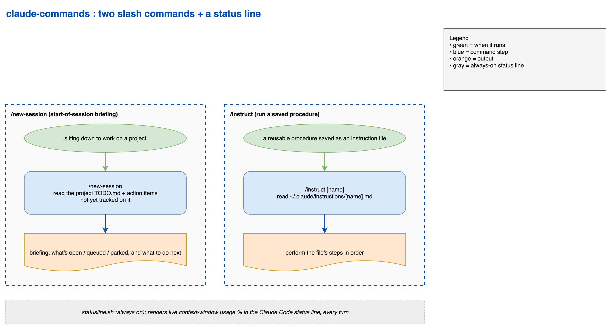

# Claude Code commands

Two slash commands for Claude Code, plus a status-line script that shows your context-window usage continuously.



Source: [docs/commands-flow.drawio](docs/commands-flow.drawio) (editable in draw.io).

- **`/new-session`** — start-of-session briefing for a project: its open TODO items, plus open action items not yet tracked in the TODO (from CLAUDE.md, project memory, git state, open PRs, and code markers). Read-only.
- **`/instruct <file>`**, or **`/instruct <a description of the work>`** — run an instruction file from `~/.claude/instructions/` (or a path), or, when the text matches no file, take the text itself as the instruction. Either way it switches to Plan mode, drafts a plan, and waits for your approval before executing.
- **`statusline.sh`** — prints e.g. `[Opus 5] claude-commands (main) · 37% used · 63% left · 74K/200K` (model, current directory and git branch, context used and remaining percentage, and the in-window token count vs capacity) so your usage is always visible at the bottom of the terminal. Two parts are color-coded. The context percentage is green below 40% used, yellow from 40 to 60%, and red above 60%. The token count is a gauge of the same kind: green while under 400K, a yellow `over 400K` flag once it passes 400K, and a red `over 600K` past 600K (those flags only appear in extended-context sessions, where the window is larger than 400K). The cutoffs (`YELLOW_PCT`, `RED_PCT`, `OVER_YELLOW`, `OVER_RED`) are variables at the top of the script; change them to retarget the colors and flags. The model shown is the one that actually produced the last reply, read from the session transcript, not just the session setting. A skill or command whose frontmatter pins a different model shows as `[Opus 5→Sonnet 5]` while it is active and reverts on the next plain turn, so a per-turn override is visible instead of silent.

## Install

### Commands

Copy the command files into your Claude Code commands directory:

```bash
mkdir -p ~/.claude/commands
cp commands/*.md ~/.claude/commands/
```

They're available immediately as `/new-session` and `/instruct`.

### Status line

The status line replaces the old manual "run /context" step in `/new-session`: instead of asking, your context usage shows continuously.

1. Install `jq` if you don't have it (`brew install jq` on macOS, `apt install jq` on Debian/Ubuntu). The script uses it to parse the session JSON Claude Code pipes in.
2. Copy the script and make it executable:
   ```bash
   cp statusline.sh ~/.claude/statusline.sh
   chmod +x ~/.claude/statusline.sh
   ```
3. Add this to `~/.claude/settings.json` (merge into your existing settings, don't overwrite the file):
   ```json
   {
     "statusLine": {
       "type": "command",
       "command": "bash ~/.claude/statusline.sh"
     }
   }
   ```

Restart Claude Code (or start a new session) and you'll see something like `[Opus 5] claude-commands (main) · 37% used · 63% left · 74K/200K` in the status line, with the percentage and token count color-coded green/yellow/red by fill level. The context fields can be null right after start or a `/compact`; the script falls back to `0` until the first API call populates them. The git branch is omitted when the directory isn't a repo.


#### Skill badges (optional)

The status line can also show a badge naming a skill that just ran, so you can see
at a glance whether the session has been saved since the last thing you did.

Two badges are configurable near the top of `statusline.sh`:

```bash
BADGE_A_SKILLS="save-context close-session"
BADGE_A_LABEL="Session Saved"
BADGE_B_SKILLS=""
BADGE_B_LABEL="Workflow Improved"
```

Each list holds skill or slash-command names exactly as you invoke them, separated
by spaces. An empty list disables that badge, which is why the second one is off
until you fill it in.

A badge means its skill is what happened LAST. It appears when the skill runs and
is withdrawn as soon as the session produces anything that skill did not capture,
whether that is a message you type, a background task notification, another skill
being invoked, or any further work after the skill's own turn ended. Running the
skill again brings the badge back.

The skill's own steps never withdraw its own badge, including a report it prints
and any agent it spawns. Verdicts are cached per session, and each redraw reads
only the transcript bytes added since the last one, so a long session costs about
the same as a short one.

## Notes

- `/new-session` works best if you keep per-project notes under `~/.claude/projects/<X>/` (a `TODO.md` and an optional `CLAUDE.md` / `memory/` folder). It degrades gracefully when those don't exist: it just reports what it can find from git and open PRs. Paths are derived from `$HOME`, so it works on any machine without editing.
- `/instruct` expects instruction files in `~/.claude/instructions/`. Create that folder and drop `.md` files in it, then run `/instruct <name>`. An instruction file can also take an argument: run `/instruct <path-to-file> <argument>` and everything after the path is passed to the file rather than read as part of its name. Use it for a file written to work on a target you name at call time, such as a plan path, a goal, or a mode. You can also skip the file: type the work as a sentence or a paragraph, and when nothing in the folder matches, `/instruct` takes your words as the instruction and plans against them verbatim. It says so in one line before it starts, and it asks rather than guessing when the text could be read either way.
- The commands are read-only by design except for one explicit, confirmed action (`/new-session` may offer to append uncaptured items to your `TODO.md`, only after you say yes).

## License

MIT. See [LICENSE](LICENSE).

## Model routing

The commands in this pack pin a Claude Code model alias in their frontmatter, so each artifact runs on the tier its work needs:

- `model: inherit`: planning and judgment-heavy review. These run on your session model, so start a planning or review session on your strongest model (switch with `/model`).
- `model: opus`: execution and content work
- `model: sonnet`: routine or mechanical steps

If a pinned model is not available on your plan, or you prefer different routing, edit the `model:` line in the artifact's frontmatter, or delete it to inherit your session model.
